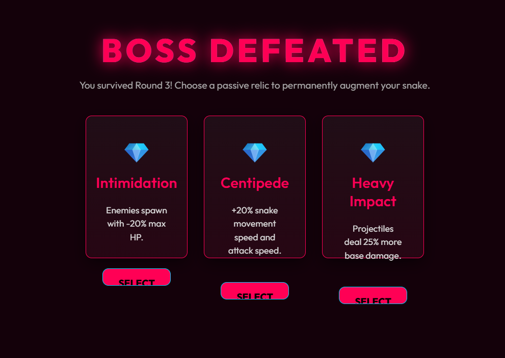

- [x] Find a way to determine the snake is properly scaled with the level. The early game should be easier and the late game should be harder. The user should be (almost always) able to defeat an early game level with enough movement skill. 
- [x] Create icons or "artistic" enhancement to heroes to better reflect what they do.
- [x] Storm hero should have actual lightning that damages enemies within a certain range.
- [x] Boss Defeated (stage end screen) needs to be better designed and made functional. Make sure this properly scales with the level difficulty. 
- [x] Swordsman and vagrant have the same symbol.
- [x] Create a "key" so user know what tiers the available heroes are.
- [x] Create a "how to play" section. This should be accessible from the main menu.
- [x] Add a "made with <3 by Alex" to the footer and link to alexschmaltz.com
- [x] Fix alignment issue on "Hire" button

- [x] How to play button text isnt visible on hover
- [x] Add space betwween numbeered list on How to play popup
- [x] The lightning doesnt visually look like lightning. It looks like a blue line... have it jagged and with a flash effect. 
- [x] Alignment issues on hero cards when one has more content then the others

- [x] Investigate bug with lightning. The top left corner of the screen is constantly being hit by lightning or something... its a blue circle in the top left over and over.
- [x] Create a seperate page explaining the characteristics of each hero and class. 
- [x] 

- [x] Create a dev mode - so I can add whatever heroes I want and test synergies.
- [x] Compendium button text is not visible on hover - Compendium is not text most users will understand. Wiki?
- [x] Move the hero icons closer together in the snake. Almost touching.  